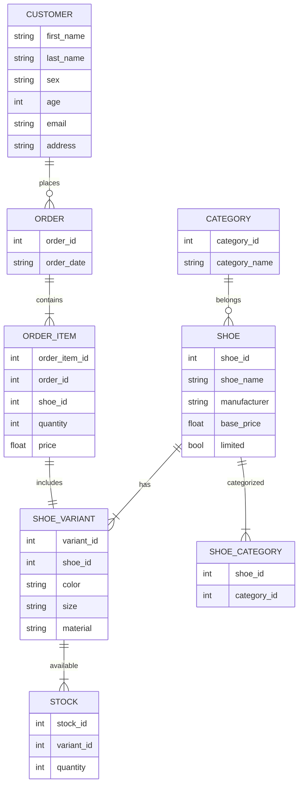

# Principles of Database System Architecture Plan
### Problem Domain
#### Developing an Academic SQL Sandbox Environment for Student Learning

The project aims to create a dynamic academic sandbox environment where students can enhance their SQL knowledge and logic skills. This environment is built using Google Colab, a Jupyter notebook platform, allowing for quick setup and accessibility. The sandbox environment is dynamically generated from a Jupyter notebook, which sources its information from GitHub. The GitHub repository includes a flask template website, an SQL source file, and relevant module imports necessary for running MySQL via the notebook. Additionally, it enables running a local website via loopback, accessible to anyone with the link through the open internet.

#### Objectives:

- Develop a Jupyter notebook on Google Colab that dynamically creates an SQL sandbox environment.
- Source necessary components (flask template website, SQL source file, module imports) from a GitHub repository.
- Enable MySQL execution within the notebook environment.
- Implement a local website via loopback for testing SQL queries against the front end.
- Ensure accessibility and ease of setup for students, regardless of their local environment capabilities.
- Provide instructors with the ability to dynamically spin up environments for students or allow students to create their instances by forking or cloning the repository.

## Tier Architecture
In the context of this project, both a two tier and three tier architecture can be accomplished. Either architecture approach can be leveraged to enhance functionality.

#### Possible approaches can be adopted for architecture:
  - **2-Tier Approach**: In this approach, students directly interact with the SQL sandbox environment within Google Colab using Python code. They write SQL commands directly in the Colab environment, which then interacts with the database and returns results.
  - **3-Tier Approach**: This approach extends the functionality by deploying a Flask template website. The Colab notebook dynamically generates a Flask link, providing students with a web interface to interact with the SQL sandbox. Students can open the Flask page and input their SQL commands via a dialogue box. The server processes these commands and returns the query results. This approach does not require them to know python.

**Considerations**:
- While the 3-tier approach provides a more user-friendly web interface for students, it introduces security concerns due to potential misuse of root-level access to the database.
- Careful consideration should be given to access control mechanisms and data validation techniques to mitigate security risks in the 3-tier approach.
- Both approaches aim to provide a flexible and accessible platform for students to practice SQL commands and enhance their skills within the academic sandbox environment.

## ER Diagram

The ER diagram depicts the structure of a shoe store database, showcasing entities such as customers, orders, shoes, variants, stock, categories, and their relationships. It illustrates how customers place orders, which consist of various shoe variants. Each shoe can have multiple variants, each with its stock availability. Additionally, shoes can belong to multiple categories for organizational purposes. This serves as a quick deployment example, focusing on the database's architecture rather than the actual interactions that occur on a commerce website.

